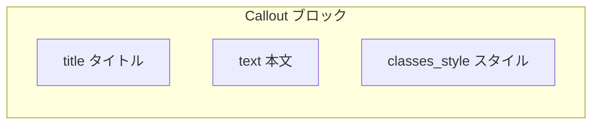

# Callout ブロック設計書

## 1. 概要

### 1.1 目的

Callout ブロックは、Universal Editor（UE）上で **短い注釈・お知らせ・補足説明** を表示するためのシンプルなコンポーネントです。Table のような行・列・子コンポーネントは持たず、**1 ブロック = 3 フィールド** で完結します。

### 1.2 Table との比較

| 項目 | Table | Callout |
|------|-------|---------|
| モデル数 | 1（+ Table Row 定義） | **1 のみ** |
| 子コンポーネント | Table Row → Text 等 | **なし** |
| filters | 2 件 | **なし** |
| JS | div → `<table>` 変換 | **不要**（空ファイル可） |
| 主な用途 | 表形式データ | 注釈・注意・ヒント |

### 1.3 設計方針

| 方針 | 内容 |
|------|------|
| 最小構成 | `block/v1/block` + 単一モデル + 空 filters |
| スタイル | `classes_style` の value をブロック root の class に反映（Teaser / Table と同型） |
| セマンティック HTML | 必須ではない。必要なら将来 `callout.js` で `<aside>` にラップ可能 |
| ブレークポイント | プロジェクト共通の **900px**（特別なレイアウト変更なし） |

### 1.4 参考

- 既存: `blocks/quote/`（richtext + text の 2 フィールド・最小 JS）
- 既存: `blocks/hero/`（JS なし・CSS のみ）
- [Content modeling for AEM authoring projects](https://www.aem.live/developer/component-model-definitions)

---

## 2. ファイル構成

```
blocks/callout/
├── _callout.json   … definitions / models / filters
├── callout.js      … 装飾不要（空 export または将来拡張用）
├── callout.css     … スタイルバリエーション
└── DESIGN.md       … 本設計書
```

| 作業 | 内容 |
|------|------|
| `npm run build:json` | `component-*.json` へマージ |
| `models/_section.json` | `section` フィルターに `"callout"` を追加 |

---

## 3. コンテンツモデル

### 3.1 コンポーネント構成



- **子コンポーネントなし** — すべてブロック自身のフィールドで編集する。
- UE 上では各フィールドが 1 行（`div > div`）として出力される。

### 3.2 モデル ID

`callout`（1 モデルのみ）

---

## 4. フィールド仕様

### 4.1 `title`（タイトル）

| 項目 | 値 |
|------|-----|
| コンポーネント | `text` |
| 必須 | 任意 |
| ラベル（UE） | Title |
| 役割 | 注釈の見出し。空の場合は CSS で非表示 |

### 4.2 `text`（本文）

| 項目 | 値 |
|------|-----|
| コンポーネント | `richtext` |
| 必須 | 推奨（空でも表示可能） |
| ラベル（UE） | Text |
| 役割 | 注釈本文。リンク・リスト等のリッチテキスト可 |

### 4.3 `classes_style`（スタイル）

| 項目 | 値 |
|------|-----|
| コンポーネント | `select` |
| フィールド名 | `classes_style` |
| ラベル（UE） | Style |
| valueType | `string` |
| デフォルト | `""`（Default） |

**選択肢**

| 表示名 | value（ブロック class） |
|--------|-------------------------|
| Default | `""` |
| Info | `info` |
| Warning | `warning` |
| Success | `success` |

**役割**

- 選択値が Callout ブロック root の class として付与される（例: `callout block info`）。
- 背景色・左ボーダー色は `callout.css` で制御する。

---

## 5. HTML 構造（Franklin 出力想定）

```html
<div class="callout block info">
  <div>
    <div>Important</div>
  </div>
  <div>
    <div><p>Please read this note before continuing.</p></div>
  </div>
</div>
```

| 行 | フィールド | 公開時の表示 |
|----|-----------|-------------|
| 1 行目 | `title` | 太字の見出し |
| 2 行目 | `text` | 本文（richtext） |

`classes_style` はメタデータ行として DOM に出ず、root class のみに反映される。

---

## 6. CSS 仕様

### 6.1 共通

- 左ボーダー 4px + 内側 padding
- 上下 margin `1rem 0`
- タイトル行: `font-weight: 700`、`margin-bottom: 0.5rem`
- 空タイトル: `display: none`

### 6.2 スタイルバリエーション

| class | 背景 | 左ボーダー |
|-------|------|-----------|
| （default） | `var(--light-color)` | `var(--dark-color)` |
| `info` | `#e8f0fe` | `var(--link-color)` |
| `warning` | `#fff8e6` | `#e6a700` |
| `success` | `#e8f5e9` | `#2e7d32` |

---

## 7. JavaScript

**現時点では装飾処理不要。**

- `callout.js` は空の `export default function decorate(block) {}` を置き、ブロック登録のみ行う。
- 将来 `<aside>` 化やアイコン自動付与が必要になった場合に拡張する。

---

## 8. UE 操作手順

1. Section 内で **「+」→ Callout** を追加
2. プロパティパネルで **Title** / **Text** / **Style** を編集
3. プレビューでスタイル（Default / Info / Warning / Success）を確認

---

## 9. テスト観点

| # | 確認項目 |
|---|---------|
| 1 | Section に Callout が追加できる |
| 2 | Title / Text が UE 上で編集できる |
| 3 | Style 変更で root class が切り替わる |
| 4 | Title 空欄時に見出し行が非表示になる |
| 5 | `npm run build:json` / `npm run lint` が成功する |

---

## 10. 変更履歴

| 日付 | 内容 |
|------|------|
| 2026-05-29 | 初版作成（Table より簡素な注釈ブロックとして定義） |
