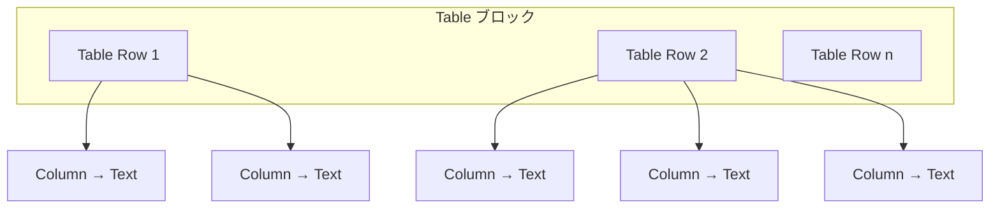

# Table ブロック仕様書

## 1. 概要

### 1.1 目的

Table ブロックは、Universal Editor（UE）上で **表形式のコンテンツ** を編集・表示するコンポーネントです。  
本仕様は **以下 3 点のみ** を要件とし、それ以外の機能はスコープ外とします。

### 1.2 要件（確定）

| # | 要件 | 内容 |
|---|------|------|
| 1 | 枠線 | Table に **黒色** の枠線を設定する |
| 2 | 行ごとのカラム | **各行** でカラム数を設定できる |
| 3 | カラムごとの Text | **各カラム** で Text を自由に設定できる |

### 1.3 スコープ外

以下は **本仕様に含めない**。

| 項目 | 理由 |
|------|------|
| ストライプ・ヘッダー行切替などのオプション | 要件にない |
| 画像・ボタン・タイトル等のセル内コンポーネント | Text のみが要件 |
| セル結合 | 要件にない |
| 列幅・配置の個別設定 | 要件にない |
| モバイル横スクロール等のレスポンシブ詳細 | 要件にない（必要最低限の表示のみ） |

---

## 2. ファイル構成（実装時）

```
blocks/table/
├── _table.json     … definitions / models / filters
├── table.js        … div グリッド → <table> 変換
├── table.css       … 黒枠線を含む表スタイル
└── DESIGN.md       … 本仕様書
```

| 作業 | 内容 |
|------|------|
| `npm run build:json` | `component-*.json` へマージ |
| `models/_section.json` | `section` フィルターに `"table"` を追加 |

---

## 3. コンテンツモデル

### 3.1 コンポーネント構成

Table は **行（Table Row）** と **カラム（Column）** の入れ子構造とする。Cards ブロック（親 → item 子）と同様の階層を採用する。



| 定義 ID | 種類 | 説明 |
|---------|------|------|
| `table` | ブロック（親） | 表コンテナ。行（Table Row）を子として持つ |
| `table-row` | 行（子） | 1 行分。**行ごとに** カラム数を設定する |
| `column` | カラム（孫） | 1 セル分。**Text** コンポーネントを 1 つ持つ |

### 3.2 モデル ID

| モデル ID | 用途 |
|-----------|------|
| `table` | ブロック本体（設定フィールドなし、または最小限） |
| `table-row` | 行。`columns` フィールドでカラム数を指定 |

---

## 4. 要件別仕様

### 4.1 要件 1: Table の枠線（黒色）

| 項目 | 仕様 |
|------|------|
| 対象 | `<table>` およびすべての `th` / `td` |
| 色 | **黒**（`#000` または `black`） |
| 線幅 | `1px solid`（セル枠線） |
| 適用方法 | **常時適用**（オプション切替なし） |
| 実装 | `table.css` で定義 |

**CSS 例（目標）**

```css
.block.table table,
.block.table table th,
.block.table table td {
  border: 1px solid #000;
}
```

> UE 編集時（div グリッド表示時）も、編集者がセル境界を認識できるよう **同じ黒枠線** を表示する。

---

### 4.2 要件 2: 各行でカラムを設定できる

| 項目 | 仕様 |
|------|------|
| 設定単位 | **行（Table Row）ごと** |
| フィールド名 | `columns` |
| ラベル（UE） | Columns |
| コンポーネント | `text`（数値入力）または `select` |
| valueType | `number` または `string` |
| デフォルト値 | `2` |
| 役割 | 当該行のカラム（セル）数を UE 上で決定する |

**select を採用する場合の選択肢（案）**

| 表示名 | 値 |
|--------|-----|
| 1 column | `1` |
| 2 columns | `2` |
| 3 columns | `3` |
| 4 columns | `4` |
| 5 columns | `5` |
| 6 columns | `6` |

**挙動**

- Table Row A を 2 カラム、Table Row B を 3 カラム、のように **行ごとに異なる列数** を設定できる。
- 行内の Column 子コンポーネント数は `columns` の値に合わせて UE 上で生成・調整される。
- 公開時、`table.js` は各行の子 `div` 数に基づき `<tr>` と `<td>` を生成する（行ごとに列数が異なってもよい）。

**JSON 例（table-row モデル）**

```json
{
  "id": "table-row",
  "fields": [
    {
      "component": "text",
      "valueType": "number",
      "name": "columns",
      "value": "2",
      "label": "Columns"
    }
  ]
}
```

---

### 4.3 要件 3: 各カラムで Text を自由に設定できる

| 項目 | 仕様 |
|------|------|
| セル内コンポーネント | **Text のみ** |
| コンポーネント ID | `text` |
| resourceType | `core/franklin/components/text/v1/text` |
| 編集内容 | 著者が UE 上で **自由に** テキストを入力・編集できる |
| 必須 | 任意（空セル可） |

**フィルター定義（目標）**

```json
{
  "id": "table",
  "components": ["table-row"]
},
{
  "id": "table-row",
  "components": ["column"]
},
{
  "id": "column",
  "components": ["text"]
}
```

> Column フィルターは Table 専用とし、Columns ブロック用の `column` フィルターと混同しないよう、必要に応じて `table-column` 等の ID に分離する（実装時に確定）。

**挙動**

- 各カラム（セル）に Text コンポーネントを 1 つ配置する。
- セルごとに独立してテキストを編集できる。
- Text 以外（Image / Button / Title 等）は **追加不可** とする。

---

## 5. definitions テンプレート（案）

### 5.1 Table（親）

```json
{
  "title": "Table",
  "id": "table",
  "plugins": {
    "xwalk": {
      "page": {
        "resourceType": "core/franklin/components/block/v1/block",
        "template": {
          "name": "Table",
          "filter": "table"
        }
      }
    }
  }
}
```

### 5.2 Table Row（子）

```json
{
  "title": "Table Row",
  "id": "table-row",
  "plugins": {
    "xwalk": {
      "page": {
        "resourceType": "core/franklin/components/columns/v1/columns",
        "template": {
          "name": "Table Row",
          "model": "table-row",
          "columns": "2",
          "rows": "1",
          "filter": "table-row"
        }
      }
    }
  }
}
```

---

## 6. HTML 出力と DOM 変換

### 6.1 AEM 出力（変換前・想定）

```html
<div class="table block">
  <div class="table-row columns-2-cols">
    <div><div>…Text 1…</div></div>
    <div><div>…Text 2…</div></div>
  </div>
  <div class="table-row columns-3-cols">
    <div><div>…Text 1…</div></div>
    <div><div>…Text 2…</div></div>
    <div><div>…Text 3…</div></div>
  </div>
</div>
```

### 6.2 `table.js` 変換後（目標）

```html
<div class="table block">
  <table>
    <tbody>
      <tr>
        <td>…Text 1…</td>
        <td>…Text 2…</td>
      </tr>
      <tr>
        <td>…Text 1…</td>
        <td>…Text 2…</td>
        <td>…Text 3…</td>
      </tr>
    </tbody>
  </table>
</div>
```

### 6.3 `table.js` の責務

| 処理 | 内容 |
|------|------|
| グリッド → 表 | Table Row ごとの子 `div` を `<tr>`、行内の Column 子 `div` を `<td>` に変換 |
| UE 属性維持 | `moveInstrumentation` で計測属性を移行 |
| ヘッダー行 | **非対応**（すべて `<td>`。要件外） |

---

## 7. CSS 設計

| 要素 | 指定 |
|------|------|
| `table` | `width: 100%`、`border-collapse: collapse` |
| `th`, `td` | `border: 1px solid #000`（要件 1） |
| セル内 Text | 左寄せ（デフォルト） |

---

## 8. テスト観点

- [ ] 表および全セルに **黒色の枠線** が表示される
- [ ] 行 A と行 B で **異なるカラム数** を設定できる
- [ ] 各カラムで **Text を自由に編集** できる
- [ ] Text 以外のコンポーネントは Column に追加できない
- [ ] 公開ページで div グリッドが `<table>` に正しく変換される
- [ ] `npm run lint` が通る

---

## 9. 変更履歴

| 日付 | 内容 |
|------|------|
| 2026-06-17 | 初版作成（要件 3 点のみに絞って作り直し） |
