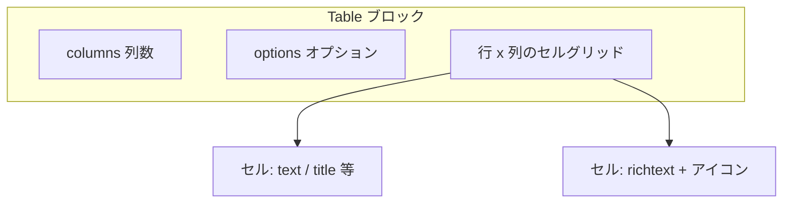

# Table ブロック設計書

## 1. 概要

### 1.1 目的

Table ブロックは、Universal Editor（UE）で編集可能な **表形式コンテンツ** を表示するコンポーネントです。デスクトップでは表をそのまま全幅表示し、モバイルでは横スクロールで閲覧できるようにします。

### 1.2 要件（表示・レイアウト）

| 項目 | 仕様 |
|------|------|
| 名称 | Table |
| デスクトップ | 表をそのまま表示。横幅は親コンテナに追従し **100%** |
| モバイル | **横スクロール** |
| 列幅 | 内容量に応じて自動調整（`table-layout: auto`） |
| セル内リッチテキスト | アイコン挿入時は **左寄せ** で表示 |

### 1.3 設計方針

| 方針 | 内容 |
|------|------|
| モデルフィールド | **2 つのみ**（`columns` / `options`） |
| セル本文 | UE 上でグリッドの各セルに子コンポーネント（text 等）を配置 |
| セマンティック HTML | Franklin の `div` グリッドを `<table>` に変換（`table.js`） |
| スタイル | レスポンシブ・表レイアウトは `table.css`。`options` はブロック class に反映 |
| ブレークポイント | プロジェクト共通の **900px** |

### 1.4 参考

- [Content modeling for AEM authoring projects](https://www.aem.live/developer/component-model-definitions)
- 既存: `blocks/columns/`（列数指定＋セルに子コンポーネント）

---

## 2. ファイル構成（実装時）

```
blocks/table/
├── _table.json     … definitions / models / filters
├── table.js        … div グリッド → <table> 変換
├── table.css       … レスポンシブ・表スタイル
└── DESIGN.md       … 本設計書
```

| 作業 | 内容 |
|------|------|
| `npm run build:json` | `component-*.json` へマージ |
| `models/_section.json` | `section` フィルターに `"table"` を追加 |

---

## 3. コンテンツモデル

### 3.1 コンポーネント構成

| 定義 ID | 種類 | 説明 |
|---------|------|------|
| `table` | `block/v1/block` または `columns/v1/columns` 相当 | 表コンテナ。列数は `columns` フィールドで指定 |

> 実装時に HTML グリッド構造を確認し、Columns ブロックと同型の resourceType を採用するか最終決定する。



**子コンポーネント（セル内）**

- ブロック設定フィールドとは別に、各セルへ **text / title / image / button** 等を配置（Columns の `column` フィルターと同様の想定）。
- フィルター定義は実装時に `_table.json` の `filters` で確定する。

### 3.2 モデル ID

`table`（1 モデルのみ。行用の別モデルは持たない）

---

## 4. フィールド仕様（確定）

仕様表の表記 `colmuns` は **列数** を意味する。実装時のフィールド名は Franklin 慣例に合わせ **`columns`** とする。

### 4.1 `columns`（列数）

| 項目 | 値 |
|------|-----|
| フィールド名 | `columns`（仕様表記: colmuns） |
| ラベル（UE） | Columns / 列数 |
| コンポーネント | `select` |
| valueType | `string` |
| デフォルト値 | `1`（仕様表記: 1 column / 1colmuns） |
| 必須 | 任意（バリデーションなし） |
| バリデーションメッセージ | N/A |

**select の選択肢（案）**

| 表示名（name） | 値（value） |
|---------------|-------------|
| 1 column | `1` |
| 2 columns | `2` |
| 3 columns | `3` |
| 4 columns | `4` |
| 5 columns | `5` |
| 6 columns | `6` |

**役割**

- UE テンプレートの列数（例: `template.columns`）および／またはブロック class（例: `columns-2-cols`）に反映する。
- `table.js` は行内のセル `div` 数と組み合わせ、最大列数の目安として利用する。

**JSON 例**

```json
{
  "component": "select",
  "name": "columns",
  "label": "Columns",
  "valueType": "string",
  "value": "1",
  "options": [
    { "name": "1 column", "value": "1" },
    { "name": "2 columns", "value": "2" },
    { "name": "3 columns", "value": "3" },
    { "name": "4 columns", "value": "4" },
    { "name": "5 columns", "value": "5" },
    { "name": "6 columns", "value": "6" }
  ]
}
```

### 4.2 `options`（オプション）

| 項目 | 値 |
|------|-----|
| フィールド名 | `options` |
| ラベル（UE） | Options / オプション |
| コンポーネント | `multiselect` |
| valueType | `string`（複数値はカンマ区切りでブロックに反映） |
| デフォルト値 | なし（未選択） |
| 必須 | 任意（バリデーションなし） |
| バリデーションメッセージ | N/A |

**役割**

- Section の `style` と同様、選択した value が **ブロック root の class** として付与される（`options` フィールド名のまま、または `style` 相当のマッピングは実装時に AEM 側の挙動を確認）。
- 表示・挙動の切り替えのみ。セル数や列数は変更しない。

**multiselect の選択肢（案・要確認）**

| 表示名（name） | 値（value） | 効果（CSS / JS） |
|---------------|-------------|------------------|
| Header row | `header-row` | 先頭行を `<thead>` + `<th>` として扱う |
| Striped | `striped` | 奇数行の背景色 |
| Bordered | `bordered` | セル枠線を表示 |

> **注意:** 上記は設計時の候補。オプション一覧はステークホルダー確認後に `_table.json` で確定する。未確定の間は実装を保留してもよい。

**JSON 例**

```json
{
  "component": "multiselect",
  "name": "options",
  "label": "Options",
  "valueType": "string",
  "value": "",
  "options": [
    { "name": "Header row", "value": "header-row" },
    { "name": "Striped", "value": "striped" },
    { "name": "Bordered", "value": "bordered" }
  ]
}
```

### 4.3 フィールド一覧（まとめ）

| # | フィールド名 | タイプ | デフォルト | 必須 |
|---|-------------|--------|-----------|------|
| 1 | `columns` | select | `1` | 任意 |
| 2 | `options` | multiselect | なし | 任意 |

**持たないもの（スコープ外）**

- `col1` / `col2` など列ごとの richtext フィールド
- `table-row` 子モデル
- 行種別用の `classes_rowType`（代わりに `options` の `header-row` で表現）

---

## 5. definitions テンプレート（案）

```json
{
  "title": "Table",
  "id": "table",
  "plugins": {
    "xwalk": {
      "page": {
        "resourceType": "core/franklin/components/block/v1/block",
        "template": {
          "name": "Table",
          "model": "table",
          "columns": "1",
          "options": ""
        }
      }
    }
  }
}
```

`columns` / `options` はテンプレート初期値として上記を設定する。

---

## 6. HTML 出力と DOM 変換

### 6.1 AEM 出力（変換前・想定）

`columns` で指定した列数に応じた **行 × 列の div グリッド**（Columns ブロックに近い構造）。

```html
<div class="table block columns-3-cols header-row striped">
  <div>
    <div>…セル1…</div>
    <div>…セル2…</div>
    <div>…セル3…</div>
  </div>
  <div>
    <div>…</div>
    <div>…</div>
    <div>…</div>
  </div>
</div>
```

### 6.2 `table.js` 変換後（目標）

```html
<div class="table block columns-3-cols header-row striped">
  <div class="table-scroll">
    <table>
      <thead><!-- options に header-row がある場合 --></thead>
      <tbody>
        <tr>
          <td>…</td>
        </tr>
      </tbody>
    </table>
  </div>
</div>
```

### 6.3 `table.js` の責務

| 処理 | 内容 |
|------|------|
| グリッド → 表 | ブロック直下の各行 `div` を `<tr>`、行内の子 `div` を `<th>` / `<td>` に変換 |
| `header-row` | `options` に含まれる場合、先頭行を `<thead>` 化 |
| ラッパー | `.table-scroll` を挿入（モバイル横スクロール用） |
| 計測 | `moveInstrumentation` で UE 属性を維持 |

---

## 7. CSS 設計

### 7.1 基本

| 要素 | 指定 |
|------|------|
| `.table-scroll` | `width: 100%` |
| `table` | `width: 100%`、`table-layout: auto`、`border-collapse: collapse` |
| `th`, `td` | `text-align: left`、`vertical-align: top` |
| セル内アイコン | 左寄せ（`inline-block` + 継承） |

### 7.2 レスポンシブ（900px）

| 画面 | 挙動 |
|------|------|
| デスクトップ（`>= 900px`） | 表 100% 表示 |
| モバイル（`< 900px`） | `.table-scroll { overflow-x: auto }`、`table { min-width: min-content }` |

### 7.3 `options` 連動（案）

| class | CSS |
|-------|-----|
| `.striped` | `tbody tr:nth-child(odd)` 背景色 |
| `.bordered` | `th, td { border: 1px solid ... }` |
| `.header-row` | JS で thead 化（CSS 単体では不可） |

---

## 8. Lint・制約

### 8.1 `xwalk/max-cells`

| モデル | グループ数 |
|--------|-----------|
| `table` | `columns` + `options` = **2**（上限 4 以内） |

### 8.2 制約

| 項目 | 内容 |
|------|------|
| 列数 | `columns` の最大値（案: 6）まで。行ごとにセル数が不足する場合は空セルで埋める |
| セル結合 | 非対応 |
| `options` | 値一覧は確定後に JSON へ反映 |

---

## 9. 実装手順

1. `_table.json`（models: `columns` + `options` のみ）
2. `filters`（セル内に許可するコンポーネント）
3. `table.js` / `table.css`
4. `models/_section.json` に `"table"` 追加
5. `npm run build:json` → `npm run lint`

---

## 10. テスト観点

- [ ] `columns` のデフォルトが 1 列である
- [ ] `columns` 変更で列グリッドが UE 上で期待どおり変わる
- [ ] `options` 未選択でも表が表示される
- [ ] `options` の `header-row` で先頭行が `<th>` になる
- [ ] デスクトップ 100%・`table-layout: auto`
- [ ] モバイル横スクロール
- [ ] セル内アイコンが左寄せ
- [ ] `npm run lint` が通る

---

## 11. 変更履歴

| 日付 | 内容 |
|------|------|
| 2026-06-04 | 初版作成 |
| 2026-06-04 | モデルを 2 フィールド（`columns` / `options`）に変更。table-row 案を廃止 |
